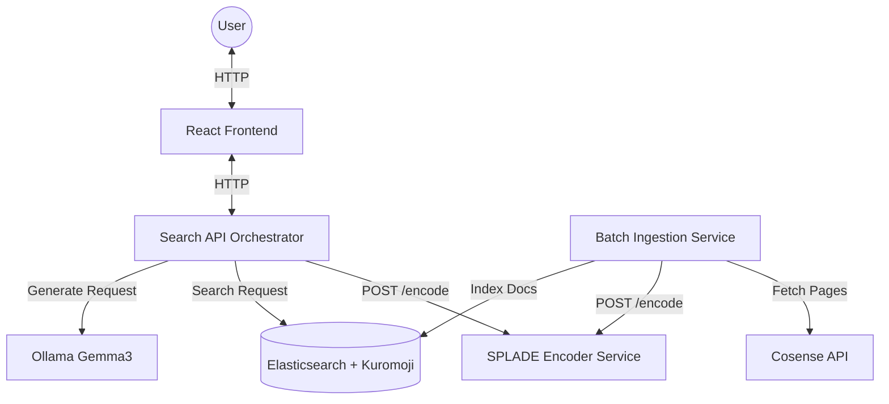

# RAG Microservice Architecture

This document describes the microservice architecture for the Cosense-based RAG application.

## Architecture Diagram

## Component Roles

| Service | Technology | Role |
| :--- | :--- | :--- |
| **UI** | React + Vite | Modern, dark-themed frontend for chat and search interface. |
| **Search API** | FastAPI | Orchestrates the RAG flow: query encoding, retrieval, and LLM generation. |
| **Encoder** | FastAPI + SPLADE | Dedicated service for Japanese SPLADE (sparse vector) encoding. |
| **Batch** | Python (uv) | Ingests data from Cosense into Elasticsearch with SPLADE vectors. |
| **Elasticsearch** | Official Image | Stores documents and sparse vectors. Uses Kuromoji for Japanese analysis. |
| **Ollama** | Local / Container | Hosts the Gemma3 LLM for answer generation. |

## Inter-service Communication

- **UI -> Search API**: `POST http://search-api:8000/query`
- **Search API -> Encoder**: `POST http://encoder:8001/encode`
- **Batch -> Encoder**: `POST http://encoder:8001/encode`
- **Search API -> Elasticsearch**: `http://elasticsearch:9200`
- **Search API -> Ollama**: `http://host.docker.internal:11434` (or configured URL)

## Execution

- **Standard Run**: `docker compose up`
- **Manual Batch**: `docker compose run --rm batch`
